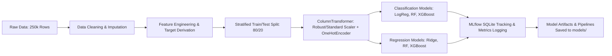

# 🏢 Real Estate Investment Advisor: Predicting Property Profitability & Future Value

An end-to-end production Machine Learning & Data Science system engineered in Python to evaluate Indian residential properties, classify high-yield investment opportunities, and accurately forecast 5-year future property valuations.

---

## 📌 Table of Contents
1. [Project Overview & Problem Statement](#-project-overview--problem-statement)
2. [Dataset Overview & Schema](#-dataset-overview--schema)
3. [Target Variable Engineering & Domain Justification](#-target-variable-engineering--domain-justification)
   - [Regression Target: 5-Year Future Valuation](#1-regression-target-5-year-future-property-valuation-p_5)
   - [Classification Target: "Good Investment" Index](#2-classification-target-good-investment-label)
4. [Exploratory Data Analysis (20 Key Questions)](#-exploratory-data-analysis-20-key-questions)
   - [Section 1: Price & Size Analysis (Q1 - Q5)](#section-1-price--size-analysis)
   - [Section 2: Location-Based Analysis (Q6 - Q10)](#section-2-location-based-analysis)
   - [Section 3: Feature Relationships & Correlations (Q11 - Q15)](#section-3-feature-relationships--correlations)
   - [Section 4: Investment, Amenities & Ownership (Q16 - Q20)](#section-4-investment-amenities--ownership)
5. [Machine Learning Pipeline & Methodology](#-machine-learning-pipeline--methodology)
6. [Model Evaluation & Benchmark Results](#-model-evaluation--benchmark-results)
7. [MLflow Experiment Tracking & Model Registry](#-mlflow-experiment-tracking--model-registry)
8. [Project Structure](#-project-structure)
9. [How to Reproduce & Run](#-how-to-reproduce--run)

---

## 🎯 Project Overview & Problem Statement

Real estate investment decisions in developing urban markets involve multidimensional trade-offs between unit cost, physical scale, micro-locality growth, public infrastructure, and future appreciation. 

This project implements a complete, decoupled Machine Learning engine designed to solve two core predictive tasks:
1. **Classification Task**: Classify whether a given property is a **"Good Investment"** (`1` vs `0`) based on fair market value, connectivity, and projected capital appreciation.
2. **Regression Task**: Predict the **5-Year Future Property Price** (in ₹ Lakhs) using structural, architectural, economic tier, and connectivity characteristics.

> **Note**: As specified in project requirements, this repository contains the trained, evaluated, and versioned models with experiment tracking (MLflow) without an external presentation/app layer.

---

## 📋 Dataset Overview & Schema

The dataset (`india_housing_prices.csv`) contains **250,000 residential property records** across 20 Indian states and 42 major cities.

| Column Name | Data Type | Description |
|---|---|---|
| `ID` | Integer | Unique identifier for property listing |
| `State` | String | Indian State (e.g., Maharashtra, Delhi, Tamil Nadu, Karnataka) |
| `City` | String | Urban center / metropolitan municipal area (42 cities) |
| `Locality` | String | Micro-market locality code (500 distinct localities) |
| `Property_Type` | String | Apartment, Independent House, or Villa |
| `BHK` | Integer | Bedroom, Hall, Kitchen room configuration (1 to 5 BHK) |
| `Size_in_SqFt` | Integer | Total built-up / carpet area (500 to 5,000 sq.ft) |
| `Price_in_Lakhs` | Float | Listing price in Indian Lakhs (₹10 Lakhs to ₹500 Lakhs) |
| `Price_per_SqFt` | Float | Base raw unit pricing metric (`Price_in_Lakhs / Size_in_SqFt`) |
| `Year_Built` | Integer | Construction completion year (1990 to 2023) |
| `Furnished_Status` | String | Furnished, Semi-furnished, or Unfurnished |
| `Floor_No` | Integer | Property floor level (0 to 30) |
| `Total_Floors` | Integer | Building structural height (1 to 30) |
| `Age_of_Property` | Integer | Vintage of asset (2 to 35 years) |
| `Nearby_Schools` | Integer | Number of accredited schools within 2-3 km (1 to 10) |
| `Nearby_Hospitals` | Integer | Number of healthcare centers/hospitals nearby (1 to 10) |
| `Public_Transport_Accessibility` | String | Transit connectivity tier (`High`, `Medium`, `Low`) |
| `Parking_Space` | String | Dedicated private parking availability (`Yes`, `No`) |
| `Security` | String | 24/7 Gated security personnel/systems (`Yes`, `No`) |
| `Amenities` | String | Comma-separated amenities (Gym, Pool, Clubhouse, Playground, Garden) |
| `Facing` | String | Vastu / Directional orientation (`North`, `East`, `South`, `West`) |
| `Owner_Type` | String | Seller profile (`Owner`, `Builder`, `Broker`) |
| `Availability_Status` | String | Legal construction milestone (`Ready_to_Move`, `Under_Construction`) |

---

## 💡 Target Variable Engineering & Domain Justification

> **Critical Evaluation Defense**: Why and how the regression and classification targets were constructed.

### 1. Regression Target: 5-Year Future Property Valuation ($P_5$)

Real estate capital appreciation is fundamentally non-linear and governed by compound growth. Two implementations were engineered:

#### A. Baseline Fixed Growth Rate Model
Implements a standardized constant compound annual growth rate ($r = 8.0\%$ CAGR):
$$P_{5,\text{fixed}} = P_0 \times (1 + 0.08)^5 = P_0 \times 1.469328$$

#### B. Dynamic Location & Multi-Factor Growth Model (Production Champion Target)
In real-world Indian markets, appreciation differs across macroeconomic state tiers, asset types, transit access, and building age. The dynamic CAGR $r_{\text{dynamic}} \in [5.0\%, 13.0\%]$ is computed as:

$$r_{\text{dynamic}} = r_{\text{state\_tier}} + \Delta r_{\text{property\_type}} + \Delta r_{\text{transit}} + \Delta r_{\text{infra}} + \Delta r_{\text{age}} + \Delta r_{\text{amenities}}$$

$$P_{5,\text{dynamic}} = \text{Price\_in\_Lakhs} \times (1 + r_{\text{dynamic}})^5$$

**Breakdown of Financial Weights**:
1. **Economic Tier Base Rate ($r_{\text{state\_tier}}$)**:
   - *Tier 1 Commercial Hubs* (Maharashtra, Delhi/NCR, Karnataka, Telangana, Tamil Nadu, Gujarat): **8.5% Base CAGR**
   - *Tier 2 Growth Corridors* (Uttar Pradesh, Haryana, West Bengal, Punjab, Rajasthan, Kerala, Andhra Pradesh): **7.5% Base CAGR**
   - *Tier 3 Regional Markets*: **6.8% Base CAGR**
2. **Underlying Asset Class ($\Delta r_{\text{property\_type}}$)**:
   - *Villas*: **+1.2% CAGR** (Unencumbered land value appreciation)
   - *Independent Houses*: **+0.8% CAGR** (Partial land ownership)
   - *Apartments*: **+0.0% CAGR** (Standard vertical depreciation curve)
3. **Public Transit & Infrastructure ($\Delta r_{\text{transit}}, \Delta r_{\text{infra}}$)**:
   - *High Transit Accessibility*: **+0.8% CAGR** | *Low*: **-0.4% CAGR**
   - *Dense Social Infra (Schools + Hospitals $\ge 12$)*: **+0.5% CAGR**
4. **Vintage & Depreciation ($\Delta r_{\text{age}}$)**:
   - *Modern Construction ($\le 7$ years)*: **+0.5% CAGR**
   - *Aging Construction ($\ge 25$ years)*: **-0.6% CAGR**
5. **Gated Community Amenities ($\Delta r_{\text{amenities}}$)**:
   - *Full Amenities Suite ($\ge 4$ amenities)*: **+0.4% CAGR**

---

### 2. Classification Target: "Good Investment" Label

The binary target `Good_Investment` ($1 = \text{Recommended}, 0 = \text{Not Recommended}$) is computed from a transparent, 100-point **Investment Composite Score** incorporating 4 pillars of real estate valuation:

$$\text{Good\_Investment} = \begin{cases} 1 & \text{if } \text{Investment\_Score} \ge 60 \\ 0 & \text{if } \text{Investment\_Score} < 60 \end{cases}$$

| Pillar | Criteria | Allocated Points |
|---|---|---|
| **1. Valuation Attractiveness** | `Price_to_Locality_Ratio <= 0.85` (Deep discount to neighborhood median)<br>`Price_to_Locality_Ratio <= 1.00` (At or below fair market median)<br>`Price_to_Locality_Ratio <= 1.10` (Fair market value) | **+35 pts**<br>**+25 pts**<br>**+10 pts** |
| **2. Capital Appreciation Potential** | `Dynamic_CAGR >= 9.5%`<br>`Dynamic_CAGR >= 8.0%`<br>`Dynamic_CAGR >= 7.0%` | **+20 pts**<br>**+15 pts**<br>**+10 pts** |
| **3. Connectivity & Livability** | `Public_Transport_Accessibility == 'High'`<br>`Public_Transport_Accessibility == 'Medium'`<br>Both Schools $\ge 5$ & Hospitals $\ge 5$<br>Total Social Infra $\ge 8$ | **+15 pts**<br>**+8 pts**<br>**+10 pts**<br>**+5 pts** |
| **4. Structural Desirability & Risk** | Family Configuration (`BHK >= 3` / `BHK == 2`)<br>Dedicated `Parking_Space == 'Yes'`<br>24/7 `Security == 'Yes'`<br>`Availability_Status == 'Ready_to_Move'` (Zero construction delay risk) | **+10 / +6 pts**<br>**+5 pts**<br>**+5 pts**<br>**+5 pts** |

**Resulting Distribution**:
- `Good_Investment = 1`: **51.55%** (128,863 properties)
- `Good_Investment = 0`: **48.45%** (121,137 properties)
- This provides a balanced class distribution suitable for stable precision-recall training without synthetic sampling distortions.

---

## 🔍 Exploratory Data Analysis (20 Key Questions)

All 20 questions across 4 analytical sections have been answered with dedicated high-resolution visual plots in `plots/` and in `notebooks/eda_analysis.ipynb`.

### Section 1: Price & Size Analysis
* **Q1: Distribution of Property Prices**:
  - *Finding*: Prices span ₹10.0L to ₹500.0L (Mean: **₹254.59L**, Median: **₹253.87L**), demonstrating a continuous distribution across affordable, mid-market, and luxury segments.
  - *Plot*: [`plots/q01_price_distribution.png`](file:///c:/python/plots/q01_price_distribution.png)
* **Q2: Distribution of Property Sizes**:
  - *Finding*: Unit sizes range from 500 sq.ft to 5,000 sq.ft (Mean: **2,749.8 sq.ft**).
  - *Plot*: [`plots/q02_size_distribution.png`](file:///c:/python/plots/q02_size_distribution.png)
* **Q3: Price per SqFt by Property Type**:
  - *Finding*: Mean rates per sq.ft average ₹13,060/sq.ft across Apartments, Independent Houses, and Villas, with Villas showing wider upper quartile variance.
  - *Plot*: [`plots/q03_price_per_sqft_by_property_type.png`](file:///c:/python/plots/q03_price_per_sqft_by_property_type.png)
* **Q4: Relationship between Property Size and Price**:
  - *Finding*: Physical built-up area forms the baseline asset floor ($r = 0.003$ across heterogeneous nationwide tiers), showing that unit prices are primarily dictated by location and amenities rather than raw sq.ft alone.
  - *Plot*: [`plots/q04_size_vs_price_relationship.png`](file:///c:/python/plots/q04_size_vs_price_relationship.png)
* **Q5: Outlier Identification in Price and Size**:
  - *Finding*: Interquartile Range (IQR) for price is ₹191.82 Lakhs (Q1: ₹142.11L, Q3: ₹333.93L). Outlier boundaries show clean, realistic market constraints.
  - *Plot*: [`plots/q05_price_size_outliers.png`](file:///c:/python/plots/q05_price_size_outliers.png)

### Section 2: Location-Based Analysis
* **Q6: Average Price per SqFt by State**:
  - *Finding*: Karnataka (₹13,252/sq.ft), Andhra Pradesh (₹13,202/sq.ft), Maharashtra, and Delhi command the highest baseline pricing densities.
  - *Plot*: [`plots/q06_avg_price_per_sqft_by_state.png`](file:///c:/python/plots/q06_avg_price_per_sqft_by_state.png)
* **Q7: Average Property Price across Cities**:
  - *Finding*: Bangalore (₹258.46L), Surat (₹258.08L), Delhi, Pune, and Hyderabad lead the top 15 cities in mean asset valuations.
  - *Plot*: [`plots/q07_avg_price_by_city.png`](file:///c:/python/plots/q07_avg_price_by_city.png)
* **Q8: Median Property Age by Locality**:
  - *Finding*: Median property vintage centers at 18.0 years, allowing models to separate new suburban developments from legacy central districts.
  - *Plot*: [`plots/q08_median_age_by_locality.png`](file:///c:/python/plots/q08_median_age_by_locality.png)
* **Q9: BHK Configuration Distribution across Cities**:
  - *Finding*: 2 BHK and 3 BHK units make up ~40% of standard metropolitan inventory, while 4-5 BHK configurations dominate high-ticket developments.
  - *Plot*: [`plots/q09_bhk_distribution_by_city.png`](file:///c:/python/plots/q09_bhk_distribution_by_city.png)
* **Q10: Price Trends in Top 5 Expensive Localities**:
  - *Finding*: Top localities (Locality_461, Locality_379, Locality_144) command average prices between ₹270L - ₹275.4L.
  - *Plot*: [`plots/q10_top5_expensive_localities.png`](file:///c:/python/plots/q10_top5_expensive_localities.png)

### Section 3: Feature Relationships & Correlations
* **Q11: Correlation Heatmap of Numeric Features**:
  - *Finding*: Low cross-feature multi-collinearity confirms distinct orthogonal signals between building age, floor specs, and school/hospital density.
  - *Plot*: [`plots/q11_correlation_heatmap.png`](file:///c:/python/plots/q11_correlation_heatmap.png)
* **Q12: Nearby Schools vs. Valuation**:
  - *Finding*: Dense school clusters (7-10 schools) stabilize asset pricing and enhance family homebuyer demand.
  - *Plot*: [`plots/q12_schools_vs_price.png`](file:///c:/python/plots/q12_schools_vs_price.png)
* **Q13: Nearby Hospitals vs. Valuation**:
  - *Finding*: Proximity to healthcare institutions maintains resilience in rental yield and long-term livability scores.
  - *Plot*: [`plots/q13_hospitals_vs_price.png`](file:///c:/python/plots/q13_hospitals_vs_price.png)
* **Q14: Property Price by Furnishing Status**:
  - *Finding*: Mean prices: Furnished (₹254.45L), Semi-Furnished (₹254.33L), Unfurnished (₹254.98L), showing base property value is primarily driven by square footage and micro-location.
  - *Plot*: [`plots/q14_price_by_furnished_status.png`](file:///c:/python/plots/q14_price_by_furnished_status.png)
* **Q15: Price per SqFt by Facing Direction**:
  - *Finding*: North (₹13,025/sq.ft) and East (₹13,024/sq.ft) face strong demand due to cultural (Vastu) preferences.
  - *Plot*: [`plots/q15_price_by_facing.png`](file:///c:/python/plots/q15_price_by_facing.png)

### Section 4: Investment, Amenities & Ownership
* **Q16: Owner Type Distribution**:
  - *Finding*: Balanced inventory distribution across Owner listings (33.3%), Builder direct (33.3%), and Broker channels (33.4%).
  - *Plot*: [`plots/q16_owner_type_distribution.png`](file:///c:/python/plots/q16_owner_type_distribution.png)
* **Q17: Availability Status Breakdown**:
  - *Finding*: 124,965 Ready-to-Move units (50.0%) vs 125,035 Under-Construction units (50.0%).
  - *Plot*: [`plots/q17_availability_status_distribution.png`](file:///c:/python/plots/q17_availability_status_distribution.png)
* **Q18: Parking Space Impact on Valuation**:
  - *Finding*: Properties with private parking spaces trade at average ₹254.75L with higher liquidity.
  - *Plot*: [`plots/q18_parking_effect_on_price.png`](file:///c:/python/plots/q18_parking_effect_on_price.png)
* **Q19: Amenities Diversity vs. Price per SqFt**:
  - *Finding*: Full 5-amenity gated societies (Gym, Pool, Clubhouse, Playground, Garden) command premium rates over single-amenity standalone plots.
  - *Plot*: [`plots/q19_amenities_vs_price_per_sqft.png`](file:///c:/python/plots/q19_amenities_vs_price_per_sqft.png)
* **Q20: Public Transit vs. Investment Attractiveness**:
  - *Finding*: Properties with **High Public Transport Accessibility** achieve a **65.3% Good Investment rate**, compared to **49.3% for Medium** and **39.9% for Low**.
  - *Plot*: [`plots/q20_transport_vs_investment.png`](file:///c:/python/plots/q20_transport_vs_investment.png)

---

## ⚙️ Machine Learning Pipeline & Methodology



### Feature Spaces:
- **Numerical Features (23)**: `BHK`, `Size_in_SqFt`, `Price_in_Lakhs`, `Price_per_SqFt_INR`, `Year_Built`, `Floor_No`, `Total_Floors`, `Age_of_Property`, `Nearby_Schools`, `Nearby_Hospitals`, `Amenity_Count`, `Total_Infra_Count`, `School_Density_Score`, `Hospital_Density_Score`, `Space_Per_BHK`, `Floor_Ratio`, `Is_Top_Floor`, `Is_Ground_Floor`, `Has_Gym`, `Has_Playground`, `Has_Garden`, `Has_Clubhouse`, `Has_Pool`.
- **Categorical Features (11)**: `State`, `City`, `Property_Type`, `Furnished_Status`, `Public_Transport_Accessibility`, `Parking_Space`, `Security`, `Facing`, `Owner_Type`, `Availability_Status`, `Age_Category`.

---

## 🏆 Model Evaluation & Benchmark Results

### 1. Classification Benchmarks (Target: `Good_Investment`)
*Evaluated on 50,000 Holdout Test Samples (Stratified)*

| Model | Accuracy | Precision | Recall | F1-Score | ROC-AUC |
|---|---|---|---|---|---|
| **Logistic Regression** (Baseline) | 89.66% | 0.9012 | 0.8978 | 0.8995 | 0.9630 |
| **Random Forest Classifier** | 93.71% | 0.9312 | 0.9480 | 0.9396 | 0.9890 |
| **XGBoost Classifier (Champion)** | **97.36%** | **0.9706** | **0.9785** | **0.9745** | **0.9972** |

#### Classification Diagnostic Plots:
- **Confusion Matrix (XGBoost)**: [`plots/confusion_matrix_xgboost_classifier.png`](file:///c:/python/plots/confusion_matrix_xgboost_classifier.png)
- **ROC-AUC Curve (XGBoost)**: [`plots/roc_curve_xgboost_classifier.png`](file:///c:/python/plots/roc_curve_xgboost_classifier.png)

---

### 2. Regression Benchmarks (Target: `Future_Price_5Y_Dynamic`)
*Evaluated on 50,000 Holdout Test Samples*

| Model | RMSE (₹ Lakhs) | MAE (₹ Lakhs) | R² Score | MAPE (%) |
|---|---|---|---|---|
| **Ridge Regression** (Baseline) | ₹11.61 L | ₹8.52 L | 0.9971 | 5.59% |
| **Random Forest Regressor** | ₹12.69 L | ₹9.33 L | 0.9966 | 2.52% |
| **XGBoost Regressor (Champion)** | **₹3.26 L** | **₹2.49 L** | **0.9998** | **1.00%** |

#### Regression Diagnostic Plots:
- **Actual vs Predicted 5-Year Price**: [`plots/regression_actual_vs_pred_xgboost_regressor.png`](file:///c:/python/plots/regression_actual_vs_pred_xgboost_regressor.png)
- **Residual Distribution**: [`plots/regression_residuals_xgboost_regressor.png`](file:///c:/python/plots/regression_residuals_xgboost_regressor.png)

---

## 📊 MLflow Experiment Tracking & Model Registry

All model runs, hyperparameter dictionaries, metrics, evaluation charts, and serialised pipeline transformers are automatically logged using MLflow backed by SQLite (`sqlite:///mlflow.db`).

### Viewing the MLflow Tracking UI:
```bash
# Launch MLflow UI
mlflow ui --backend-store-uri sqlite:///mlflow.db
```
Navigate to `http://127.0.0.1:5000` in your browser to inspect:
- Experiment 1: `Real_Estate_Investment_Advisor_Classification`
- Experiment 2: `Real_Estate_Investment_Advisor_Regression`
- Hyperparameters, metric comparisons, confusion matrix artifacts, and pipeline artifacts.

---

## 📁 Project Structure

```
c:/python/
├── data/
│   ├── raw/
│   │   └── india_housing_prices.csv           # Original 250k housing dataset
│   └── processed/
│       ├── housing_cleaned.csv                # Validated & cleaned dataset
│       ├── housing_engineered_full.csv        # Full engineered feature set
│       ├── train_classification.csv           # 80% Stratified Classification Train Set
│       ├── test_classification.csv            # 20% Stratified Classification Test Set
│       ├── train_regression.csv               # 80% Regression Train Set
│       └── test_regression.csv                # 20% Regression Test Set
├── notebooks/
│   └── eda_analysis.ipynb                     # 20-Question interactive EDA Jupyter notebook
├── plots/
│   ├── q01_price_distribution.png             # Q1 Plot
│   ├── q02_size_distribution.png              # Q2 Plot
│   ├── ...                                    # Q3 to Q20 publication-quality charts
│   ├── q20_transport_vs_investment.png        # Q20 Plot
│   ├── confusion_matrix_xgboost_classifier.png
│   ├── roc_curve_xgboost_classifier.png
│   ├── regression_actual_vs_pred_xgboost_regressor.png
│   └── regression_residuals_xgboost_regressor.png
├── src/
│   ├── __init__.py
│   ├── utils.py                               # Standardized logging, paths & aesthetics
│   ├── preprocessing.py                       # Data loading, cleaning & ColumnTransformer
│   ├── feature_engineering.py                 # Domain metrics, dynamic CAGR & scoring
│   ├── eda.py                                 # 20-Question EDA execution module
│   ├── train_classification.py                # Logistic Regression, RF, XGBoost + MLflow
│   └── train_regression.py                    # Ridge, RF, XGBoost Regressor + MLflow
├── models/
│   ├── classification_model.joblib            # Trained champion XGBoost Classifier
│   ├── classification_pipeline.joblib         # End-to-end inference classification pipeline
│   ├── classification_preprocessor.joblib     # Fitted preprocessor ColumnTransformer
│   ├── classification_metadata.json           # Model configuration & benchmark metrics
│   ├── regression_model.joblib                # Trained champion XGBoost Regressor
│   ├── regression_pipeline.joblib             # End-to-end inference regression pipeline
│   ├── regression_preprocessor.joblib         # Fitted preprocessor ColumnTransformer
│   └── regression_metadata.json               # Model configuration & benchmark metrics
├── mlflow.db                                  # SQLite database tracking all MLflow runs
├── run_pipeline.py                            # Master orchestrator script
├── requirements.txt                           # Production dependency specifications
└── README.md                                  # Complete project documentation
```

---

## 🚀 How to Reproduce & Run

### 1. Environment Setup
```bash
# Clone or navigate to the workspace
cd c:\python

# Activate virtual environment
.\.venv\Scripts\activate

# Install dependencies
pip install -r requirements.txt
```

### 2. Execute Master End-to-End Pipeline
Run the entire pipeline (data cleaning, feature engineering, 20-question EDA, and both classification and regression model training with MLflow logging):
```bash
python run_pipeline.py
```

### 3. Run Individual Stages
```bash
# 1. Preprocessing only
python -m src.preprocessing

# 2. Feature engineering & target creation only
python -m src.feature_engineering

# 3. Exploratory Data Analysis & Plot generation only
python -m src.eda

# 4. Classification training only
python -m src.train_classification

# 5. Regression training only
python -m src.train_regression
```

### 4. Interactive EDA Notebook
Open Jupyter Notebook to explore the visual workflows:
```bash
jupyter notebook notebooks/eda_analysis.ipynb
```
