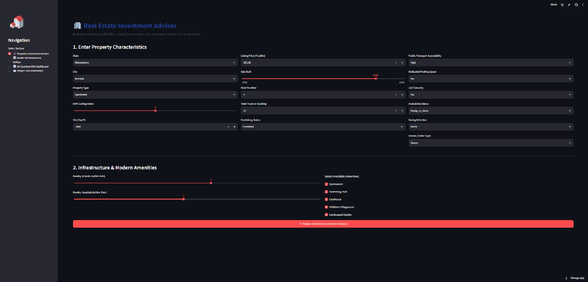
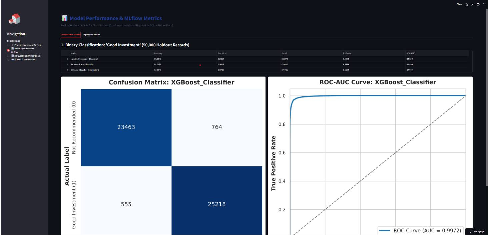
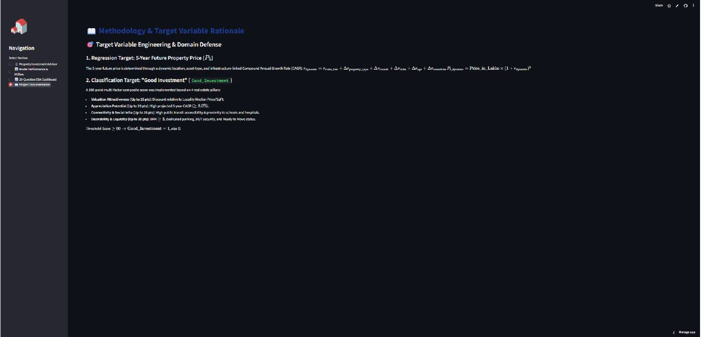
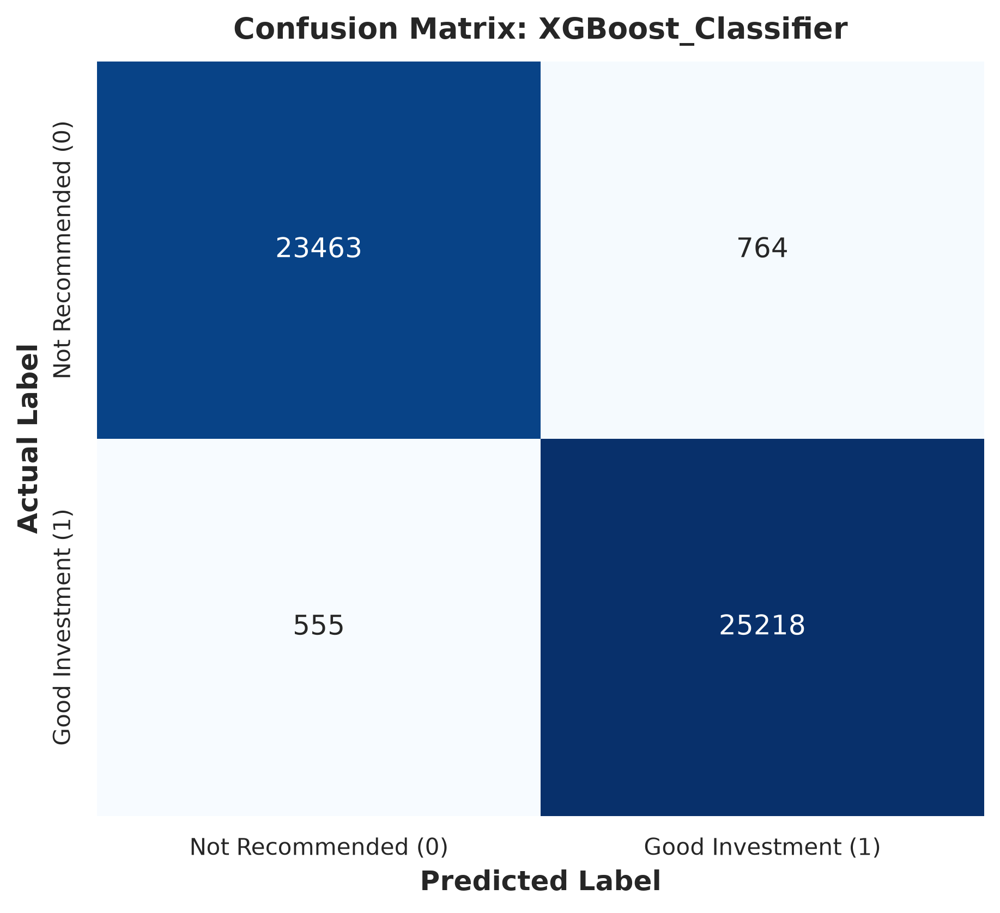
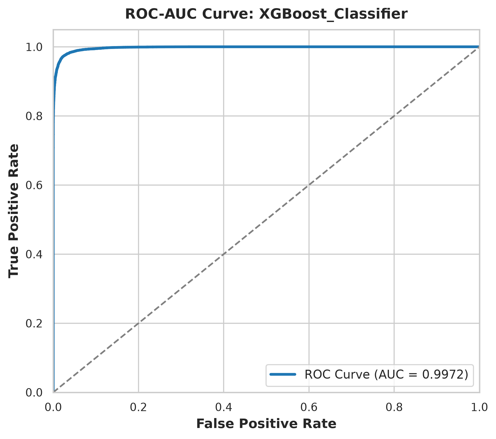
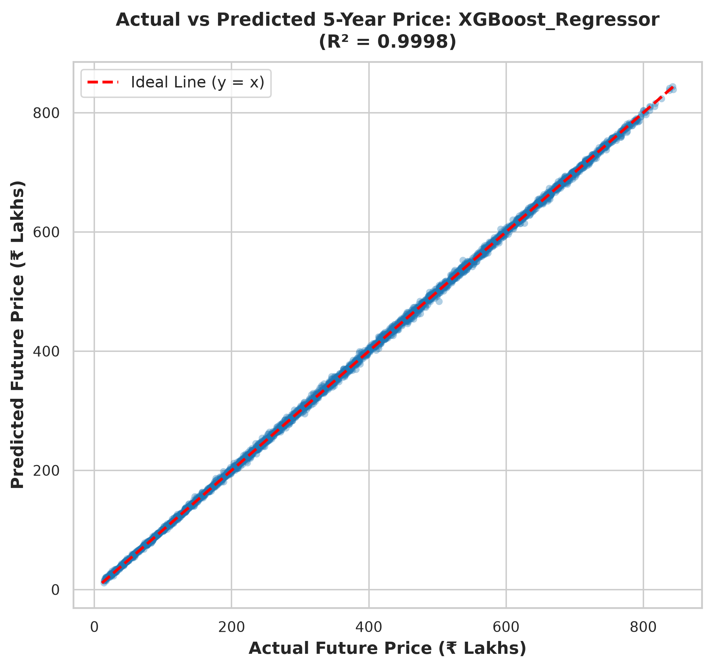
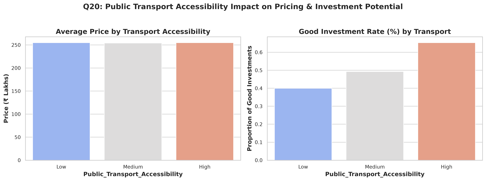
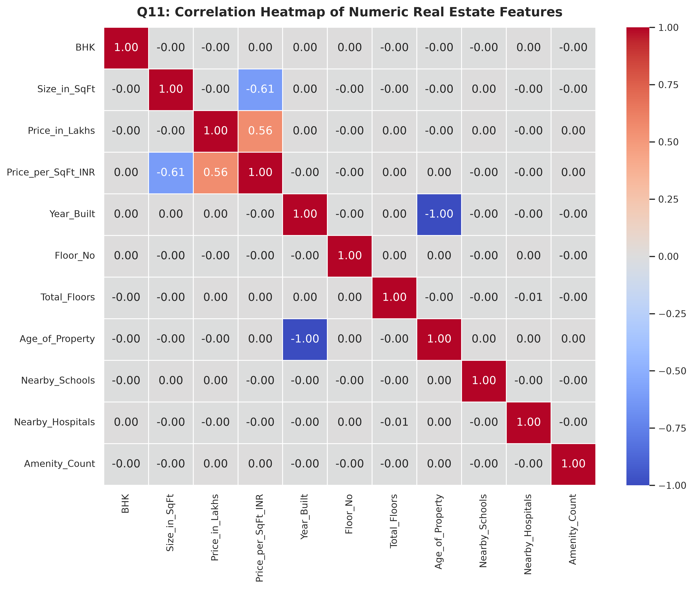
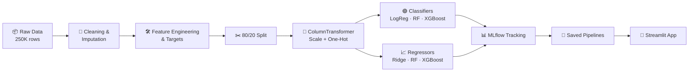

<div align="center">


<a href="https://advisorproperty.streamlit.app/">
  
</a>

<br>

[](https://advisorproperty.streamlit.app/)


**An end-to-end machine learning system that classifies Indian residential properties as good or poor investments and forecasts their price five years ahead.**

[**Live App**](https://advisorproperty.streamlit.app/) &nbsp;·&nbsp; [Results](#-results) &nbsp;·&nbsp; [EDA](#-exploratory-data-analysis) &nbsp;·&nbsp; [Run Locally](#-run-it-locally) &nbsp;·&nbsp; [Limitations](#-honest-limitations)

</div>

---

## 📑 Table of Contents

<details open>
<summary><b>Click to collapse</b></summary>

1. [Overview](#-overview)
2. [Live Demo](#-live-demo)
3. [Key Results](#-results)
4. [Dataset](#-dataset)
5. [Exploratory Data Analysis](#-exploratory-data-analysis)
6. [How the Targets Were Built](#-how-the-targets-were-built)
7. [ML Pipeline](#-ml-pipeline)
8. [Honest Limitations](#-honest-limitations)
9. [Run It Locally](#-run-it-locally)
10. [Project Structure](#-project-structure)
11. [Future Work](#-future-work)

</details>

---

## 🎯 Overview

Buying property involves trading off price, size, locality, transit, nearby schools and hospitals, building age, and expected appreciation. This project turns those factors into two clear answers:

| Task | Question | Output |
|---|---|---|
| 🟢 **Classification** | Is this a good investment? | Recommended / Not recommended, with a confidence score |
| 📈 **Regression** | What will it be worth in 5 years? | Future price in ₹ lakhs, plus gain, ROI, and implied annual growth |

Everything is tracked with **MLflow**, packaged as reusable pipelines, and deployed as a **Streamlit** web app.

---

## 🚀 Live Demo

<div align="center">

### 👉 [**advisorproperty.streamlit.app**](https://advisorproperty.streamlit.app/) 👈

*(Free-tier apps may sleep when idle. If you see a "wake up" button, click it and wait a few seconds.)*



</div>

The app has four sections:

- 🔮 **Property Investment Advisor**: enter a property's details and get a verdict plus a 5-year forecast
- 📊 **Model Performance & MLflow**: benchmark tables, confusion matrix, ROC curve
- 📈 **20-Question EDA Dashboard**: every analysis plot in one place
- 📖 **Project Documentation**: how both targets were engineered

<details>
<summary><b>📸 See more screenshots</b></summary>
<br>

**Model performance page**



**Methodology page**



</details>

---

## 🏆 Results

Evaluated on **50,000 held-out records**. XGBoost won both tasks.

### Classification: `Good_Investment`

| Model | Accuracy | Precision | Recall | F1 | ROC-AUC |
|---|:---:|:---:|:---:|:---:|:---:|
| Logistic Regression (baseline) | 89.66% | 0.9012 | 0.8978 | 0.8995 | 0.9630 |
| Random Forest | 93.71% | 0.9312 | 0.9480 | 0.9396 | 0.9890 |
| **XGBoost (champion)** 🥇 | **97.36%** | **0.9706** | **0.9785** | **0.9745** | **0.9972** |

### Regression: `Future_Price_5Y_Dynamic`

| Model | RMSE (₹L) | MAE (₹L) | R² | MAPE |
|---|:---:|:---:|:---:|:---:|
| Ridge Regression (baseline) | 11.61 | 8.52 | 0.9971 | 5.59% |
| Random Forest | 12.69 | 9.33 | 0.9966 | 2.52% |
| **XGBoost (champion)** 🥇 | **3.26** | **2.49** | **0.9998** | **1.00%** |

<div align="center">



</div>

> ⚠️ **Read these numbers with context.** The targets were built by formula from the dataset's own columns, so near-perfect scores confirm the pipeline works, not that it predicts real market prices. See [Honest Limitations](#-honest-limitations).

---

## 📋 Dataset

**250,000 residential listings** across **20 states**, **42 cities**, and **500 localities**, with 22 columns.

| Group | Columns |
|---|---|
| 🏠 Structure | `Property_Type`, `BHK`, `Size_in_SqFt`, `Year_Built`, `Floor_No`, `Total_Floors`, `Age_of_Property` |
| 📍 Location | `State`, `City`, `Locality` |
| 🚇 Infrastructure | `Nearby_Schools`, `Nearby_Hospitals`, `Public_Transport_Accessibility` |
| 🏷️ Listing | `Price_in_Lakhs`, `Price_per_SqFt`, `Furnished_Status`, `Parking_Space`, `Security`, `Amenities`, `Facing`, `Owner_Type`, `Availability_Status` |

Prices range from ₹10L to ₹500L and sizes from 500 to 5,000 sq.ft.

---

## 🔍 Exploratory Data Analysis

Twenty questions across price, location, relationships, and investment factors. Every plot lives in [`plots/`](plots/) and the [notebook](notebooks/eda_analysis.ipynb).

| Finding | Detail |
|---|---|
| 💰 **Balanced prices** | Mean ₹254.6L, median ₹253.9L, no unrealistic outliers |
| 📐 **Size is a weak signal** | Size-price correlation ≈ 0.003, so location and context dominate |
| 🗺️ **Top states by ₹/sq.ft** | Karnataka (₹13,252) and Andhra Pradesh (₹13,202) |
| 🛋️ **Furnishing barely matters** | Averages differ by under ₹1 lakh |
| 🚇 **Transit drives investment quality** | Good-investment rate: **65.3%** high access, 49.3% medium, 39.9% low |

<div align="center">


</div>

---

## 🧮 How the Targets Were Built

The dataset has no "future price" or "good investment" column, so both were engineered from real estate logic.

### 📈 5-year future price

Each property gets its own annual growth rate between 5% and 13%:

```
P5 = Price_in_Lakhs × (1 + r)^5
r  = state_tier + property_type + transit + infrastructure + age + amenities
```

| Factor | Adjustment |
|---|---|
| State tier | Tier 1 hubs 8.5%, Tier 2 7.5%, others 6.8% (base) |
| Property type | Villa +1.2%, independent house +0.8% |
| Transit | High +0.8%, low −0.4% |
| Social infrastructure | Schools + hospitals ≥ 12: +0.5% |
| Building age | ≤ 7 yrs +0.5%, ≥ 25 yrs −0.6% |
| Amenities | 4 or more: +0.4% |

### ✅ Good investment (score ≥ 60 of 100)

| Pillar | Max points |
|---|:---:|
| Valuation vs locality median ₹/sq.ft | 35 |
| Appreciation potential (CAGR) | 20 |
| Connectivity & social infrastructure | 25 |
| Desirability & liquidity (BHK, parking, security, ready-to-move) | 20 |

Result: **51.55% good** (128,863) vs **48.45% not** (121,137), a balanced split with no resampling.

---

## ⚙️ ML Pipeline



**Features:** 23 numeric and 11 categorical, including engineered ones such as amenity count, school and hospital density, space per BHK, floor ratio, and top-floor flags.

---

## ⚠️ Honest Limitations

Good projects state their limits. This one does:

- **Targets come from formulas.** Both labels are computed from the same input columns, and listing price is itself a feature. The models largely relearn those formulas, which is why R² is near 1.0.
- **The data looks synthetic.** Category shares are almost perfectly balanced and size barely correlates with price.
- **Assumptions, not observations.** Growth rates and score thresholds are modelling choices, not measured market data.

**What this proves:** the pipeline is sound and the models recover complex rules. **What it does not prove:** accuracy on real future prices.

---

## 💻 Run It Locally

```bash
# 1. Clone
git clone https://github.com/<your-username>/Real-Estate-Investment-Advisor-Predicting-Property-Profitability-Future-Value.git
cd Real-Estate-Investment-Advisor-Predicting-Property-Profitability-Future-Value

# 2. Install
python -m venv .venv
source .venv/bin/activate        # Windows: .venv\Scripts\activate
pip install -r requirements.txt

# 3. Run the full pipeline (clean, engineer, EDA, train, track)
python run_pipeline.py

# 4. Launch the app
streamlit run app.py

# 5. (Optional) Browse experiments
mlflow ui --backend-store-uri sqlite:///mlflow.db
```

<details>
<summary><b>Run individual stages</b></summary>

```bash
python -m src.preprocessing           # cleaning
python -m src.feature_engineering     # features + targets
python -m src.eda                     # 20-question EDA
python -m src.train_classification    # classifiers
python -m src.train_regression        # regressors
```

</details>

---

## 📁 Project Structure

```
├── app.py                      # Streamlit web app
├── run_pipeline.py             # Master pipeline orchestrator
├── requirements.txt
├── assets/                     # README banner and screenshots
├── models/                     # Saved pipelines and metadata (.joblib, .json)
├── notebooks/
│   └── eda_analysis.ipynb      # 20-question EDA notebook
├── plots/                      # EDA and evaluation charts
└── src/
    ├── preprocessing.py        # Loading, cleaning, ColumnTransformer
    ├── feature_engineering.py  # Dynamic CAGR, investment score, features
    ├── eda.py                  # EDA plots
    ├── train_classification.py # LogReg, RF, XGBoost + MLflow
    ├── train_regression.py     # Ridge, RF, XGBoost + MLflow
    └── utils.py
```

---

## 🔭 Future Work

- [ ] Train on real historical transaction data with observed price changes
- [ ] Remove leaky inputs and use time-based validation
- [ ] Add hyperparameter tuning and SHAP explanations
- [ ] Add locality comparison and rental-yield estimates

---

<div align="center">

**Built by Dazai**

If this project helped you, consider giving it a ⭐

[](https://advisorproperty.streamlit.app/)

</div>
